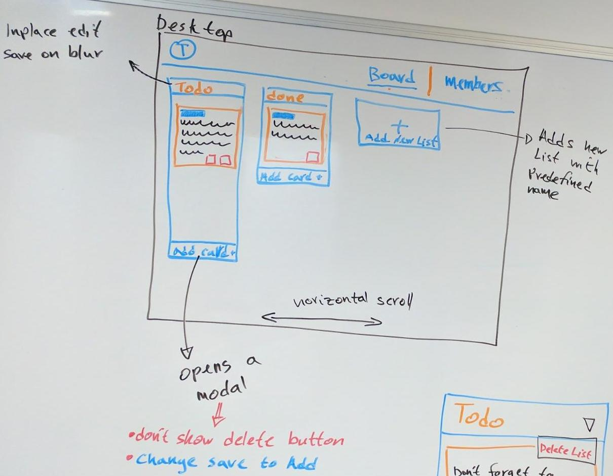
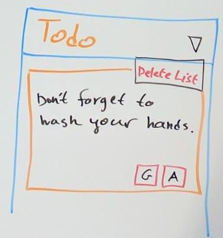
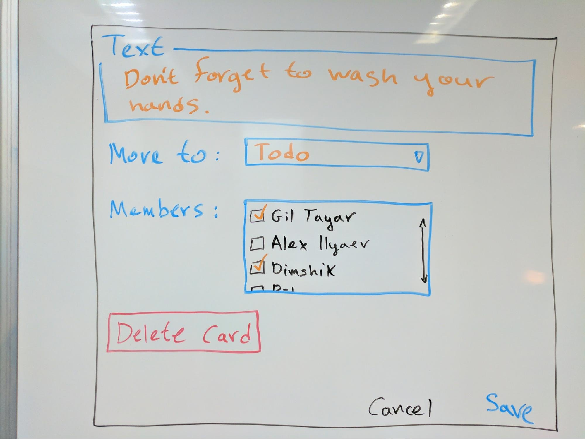

Taskboard Specification
=======================

The Taskboard is a [Trello](https://trello.com/)-like application, which enables the user to create **tasks**
(also called **cards**) and move them between **lists** (also called **columns**)

This document is a specification of how the Taskboard app looks and behaves.

Overview
--------

There are two views, which are navigable using the menu:

The two views are:

1. Boards: the main view, which shows a board, with its lists and tasks
1. Members: the list of the members of the Boards

Board Components
----------------

A list of all the components that will be shown in the Boards view.

### List

* Each list will have a maximum height. Can’t be more than screen height.
* If there are more lists than can fit the screen - use horizontal scrolling.
  See [a video of this in action](spec-assets/videos/scrollable-lists-horizontal.mp4).
* The title of the list and the footer (**Add card** button) are fixed to the top and bottom.
  See [a video of this in action](spec-assets/videos/lists-in-action.mp4).
* If the content of the list exceeds its height, a vertical scroll will be added.
  See [a video of this in action](spec-assets/videos/task-cards-in-list.mp4).
* List name will be edited in place.
  * Click on the name will replace it with an input field.
  * The input field will contain the list name.
  * The user will be able to change the name.
  * On blur
    * The name will be **saved**.
    * The input field will disappear.
* Clicking on **Add new list** will add a list at the end, with the name “New List”.
* A sub menu will be available on click on the arrow button.
  * The sub menu will hold a **Delete** button.
  * When the **Delete** button is clicked, a prompt will pop and ask the user if he is sure.
    “**Deleting TODO list. Are you sure?**”
  * If the user answers yes, the list will be deleted.

### Task (Card)

* A list is a set of cards, where each card contains:
* A description
* A list of icons with the members that are assigned to the card,
  where each icon is actually the uppercase first letter of their name.
* A button **edit** which will open the “Card Edit modal”
* The button **edit** will appear on mouse over on the whole card.

### Card Edit Modal

* Will appear when the user clicks on **Add card** in the list or
  when the user clicks on edit card in the card component.
* The “Card Edit” is modal, i.e. will not allow anything else to be done
  until “Cancel” or “Save” is clicked.
* The “Text” field will show the description of the card
  (with the current text of the card shown initially), and enable editing.
* The **Move to** field is a combo with a list of all the lists,
  with the current list of the card shown as the initial value.
* A **Delete card** button, when clicked, will delete the card from the list.
* The **Cancel** button will hide the modal, and do nothing.
* The **Save** button will update the card with the new text.
  If the list that the card is in was changed, it will remove it from the original list,
  and append (to last) it to the new list.
* In the “Add card” mode, the “Delete card” is not visible, and the “Save” button is renamed to “Add”.
* A list of all the members will appear in this modal,
  to the side of each member a check box will be placed and represent if the user was added to this card.

Member Components
-----------------

A list of all the components that will be shown in the Members view.

### Members View

* This view will contain all the members of the task board.
* It will be on a different “page”.
* The members will be presented in a list.
* On mouse over on one of the names, two buttons will appear to the right of that name.
* Edit button and Delete button.
* Click on the Edit button will let the user to edit the member name in place.
  * The name will be replaced with an input field.
  * The input field will contain the member name.
  * The user will be able to change the name.
  * A different set of buttons will be to the right of the input field (Editing mode)
    * Save button and Cancel button.
    * When the **Save** button is clicked, the input field is removed and the new name appears instead.
    * When **Cancel** button is clicked, the input field is removed and the old name is left without change.
* When the **Delete** button is clicked, a prompt will pop and ask the user if he is sure.
  “**Deleting member ‘Bob’. Are you sure?**”
